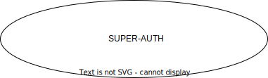

# super-auth

***Super multicomponent authorization***




This project represents the practial approach how to integrate Keycloak for authentication and authorization with FastAPI backend and ReactJS frontend, all served behind an NGINX reverse proxy. Messages for services linking can be sended via Kafka. This setup is ideal for building secure web applications with modern authentication mechanisms.

## Table of Contents

- [Features](#features)
- [Technologies Used](#technologies-used)
- [Getting Started](#getting-started)
- [Configuration](#configuration)
- [Running the Application](#running-the-application)
- [API Endpoints](#api-endpoints)
- [License](#license)

## Features

- Secure registration, authentication and authorization using Keycloak
- FastAPI for building high-performance APIs
- ReactJS for a dynamic frontend
- NGINX as a load balancer and reverse proxy
- Docker support for easy deployment

## High-Level Technologies Used

- Python, TypeScript, JavaScript, Shell - Programming languages
- HTML, SCSS, CSS - Markdown and Style languages
- FastAPI - Web framework for building APIs
- Keycloak - Open-source Identity and Access Management
- ReactJS - JavaScript and TypeScript library for building user interfaces
- NGINX - Web server and reverse proxy
- Docker - Containerization platform

## Getting Started

### Prerequisites

- Python 3.7 or higher
- Node.js and npm (for ReactJS)
- Docker and Docker Compose
- Keycloak server (can be run via Docker)

### Activation virtual environment 

source ./venv/bin/activate 


### Installation

1. Cloning the repository:

```bash
git clone https://github.com/Filpon/super-auth.git
cd super-auth
```

2. Creation .env file in project root directory

3. Completion .env file according to project root directory .example-env file

4. Running script via

***docker compose***

```bash
docker-compose up --build --remove-orphans -d
```

***makefile starting docker-compose***

```bash
make -d start
```

***continuous integration and continuous delivery workflow***

Deployment code according to super-auth/.github/workflows/deploy.yaml

### Installing distinct modules

***uv - preferring***

```bash
uv add package-name
```

***pip dependencies***

```bash
python -m pip install package-name
```

## Configuration
 
Updating the config.py file in the backend with your Keycloak server details, including the realm, client ID, and client secret.
Modifying the NGINX configuration files (nginx.conf, site.conf) as needed to point to your FastAPI and ReactJS applications.

## Running the Application Components

*Backend (FastAPI)*

Start the FastAPI application:

```bash
cd web-backend
source './.venv/bin/activate'
uv sync --frozen --no-cache
```
Backend activation is important for starting .pre-commit-config.yaml

*Frontend (ReactJS)*

Start the ReactJS application:

```bash
cd ../frontend
yarn build
```

*NGINX*

Start NGINX:
```bash
docker run --name nginx -p 80:80 -v $(pwd)/nginx.conf:/etc/nginx/nginx.conf:ro -d nginx
```

*Kafka*

Start Kafka:
```bash
docker exec -it kafka bash
```

Access to the application can be established via [localhost](http://localhost) in development mode. 

## API Endpoints

All current project API endpoints are available at [API DOCS PAGE](http://localhost/api/v1/docs)

## Avaibility, versions and additional features

This project uses the latest versions of Docker images that have been selected for their compatibility. This ensures a stable and secure operation of the application.

However, you have the option to specify your own versions of the images through the components of the virtual environment. It allows user to tailor the project under the specific requirements and preferences.
To do this, simply modify the relevant parameters in your environment configuration file or in the Dockerfile.

If you want to use a specific version of an image, you can do so as follows:

*Example*

```dockerfile
FROM image_name:version
```

The downloading images application components may contain and/or use external links or references to official commercial organizations that cannot be operated in some countries. It is important to verify the legality and accessibility of images linking official commercial organizations in your specific location before using.

## License

This project is licensed under Creative Commons Attribution-NonCommercial-NoDerivatives 4.0 (CC-A-NC-ND-4) and GNU General Public License version 3 (GPL-3.0) - it is possible to read the [LICENSE](./LICENSE) file for the details.
