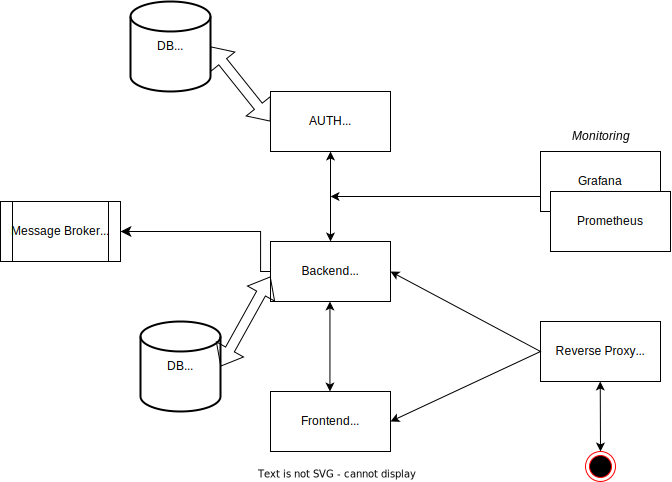

# Information Technologies Project

---

## Introduction

* Welcome to presentation! This is presentation of "Super Auth".
  *The following topics will be covered:*
  + What is Authentintication and Authorization (AUTH) with its importance
  + Project structure
  + Components description
  + Project choosing arguments

---

## Authentication

  * Definition: The process of verifying the identity of a user or system.
  * Purpose: Ensures that users are who they claim to be.
  * Methods of Authentication: 
    + Password-based: Users provide a username and password.
    + Multi-factor Authentication (MFA): Combines two or more verification methods (e.g., password + SMS code).
    + Biometric Authentication: Uses physical characteristics (e.g., fingerprints, facial recognition).

---

## Authorization

  * Definition: The process of determining what an authenticated user is allowed to do.
  * Purpose: Grants access to resources based on user permissions.
  * Methods of Authorization:
    + Role-Based Access Control (RBAC): Access is granted based on user roles.
    + Attribute-Based Access Control (ABAC): Access is granted based on user attributes and policies.
    + Access Control Lists (ACLs): Specific permissions are assigned to users or groups for resources.

---

## Authentication and Authorization (AUTH) Importance

  * Security: Protects sensitive data and resources from unauthorized access.
  * Compliance: Meets regulatory requirements and industry standards.
  * User Trust: Builds confidence in the system's ability to protect user information.

---

## Common Protocols

  * OAuth: An open standard for access delegation, commonly used for token-based authentication.
  * OpenID Connect: An identity layer on top of OAuth 2.0 for user authentication.
  * SAML (Security Assertion Markup Language): Used for exchanging authentication and authorization data between parties.

---

## Principal product structure

Centralized AUTH for microservices architecture.

---

## Fast API - Backend API
  - *Role*: FastAPI serves as the backend framework for building APIs. It handles incoming requests, processes business logic, and interacts with databases or other services. FastAPI is known for its high performance and automatic generation of API documentation.
  - *Features*:
    - Define API endpoints.
    - Validate and process incoming data.
    - Manage application logic and data retrieval.

---

## Keycloak - AUTH Component

- *Role*: According to current state project repository and documentation is open-source (currently Apache License 2.0) project identity and access management solution that provides authentication and authorization services (AUTH).
- *Features*:
  - Authenticate users and manage sessions.
  - Provide Single Sign-On (SSO) capabilities.
  - Handle user roles and permissions for access control.

---

## Kafka - Message Broker, Controller

- *Role*: According to current state project repository and documentation Apache Kafka is an open-source (currently Apache License 2.0) distributed event streaming platform designed for high-throughput, fault-tolerant data processing. It acts as a central hub for data flow, facilitating the integration of various services and applications.
- *Features*:
  - Provides high throughput and low latency for processing messages, making it suitable for real-time data processing.
  - Supports horizontal scalability, allowing users to easily add more nodes to the Kafka 
  - Various data processing models

---

## Prometheus, Grafana - Performance Monitoring

- *Role*: Performance Monitoring tools like Prometheus and Kibana are essential for tracking the health and performance of applications. Prometheus collects and stores metrics data, while Kibana provides a powerful visualization layer for analyzing and interpreting that data.
- *Features*:
  - Prometheus scrapes metrics from configured targets at specified intervals.
  - Prometheus supports alerting rules that notify developers and operators of potential issues, enabling quick responses to performance degradation or outages.
  - Grafana offers intuitive dashboards and visualizations, making it easy to analyze trends.

---

## Choosing Super Auth project, because - Part I

  - *High Performance*: FastAPI offers rapid request processing due to its asynchronous architecture, enabling the development of high-performance web applications.
  - *Security and Access Management*: Keycloak provides robust authentication and authorization tools, including support for OAuth2 and OpenID Connect, ensuring a high level of security.
  - *Modern User Interface*: ReactJS allows for the creation of interactive and responsive user interfaces, enhancing user experience and making the application more engaging.
  - *Flexibility and Scalability*: The microservices architecture allows for easy scaling of the application and the addition of new features without significant changes to the existing codebase.
  
---

## Choosing Super Auth project, because - Part II

- *Easy Deployment*: NGINX serves as a reliable web server and reverse proxy, simplifying the deployment and management of the application while providing load balancing and caching.
- *Community and Support*: All technologies have active communities and extensive documentation, making it easier to carry out issues and implement new features.
- *Cross-Platform Compatibility*: Utilizing these technologies enables the creation of applications that work across various platforms and devices, ensuring accessibility for a wide audience.
